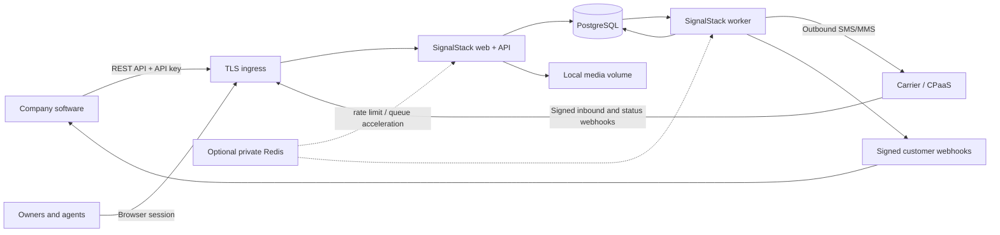

# Standalone Product Roadmap

Status: active governing roadmap
Started: 2026-07-10
Target: a feature-complete, self-hostable SMS platform that a company can operate directly and
integrate with its own software.

## Product Contract

SignalStack is complete when a company can install it on infrastructure it controls, create an
organization and team, connect a carrier-facing SMS transport, manage contacts and consent, send and
receive individual and campaign messages, operate a shared inbox, integrate through a stable API and
signed webhooks, and recover the service from backup without depending on another application SaaS.

Access to the mobile network is the one unavoidable external boundary. The default supported path is
Twilio over HTTPS; a future transport may use another CPaaS or a direct carrier/SMSC connection. A
direct carrier connection still requires a carrier relationship, assigned numbers, registration, and
network access. SignalStack must not require Clerk, Stripe, Vercel, Redis, hosted AI, hosted email,
hosted monitoring, or hosted object storage to provide its core product.

### Dependency policy

| Capability | Default | Optional alternative | Required SaaS? |
| --- | --- | --- | --- |
| Web UI and REST API | Included Next.js service | Any compatible Node host | No |
| Durable data and queue state | Included PostgreSQL service | Managed PostgreSQL | No |
| Background processing | Included database-queue worker | Private Redis/BullMQ accelerator | No |
| Identity and sessions | Built-in local auth | OIDC provider | No |
| SMS carrier access | Twilio adapter | Other CPaaS or direct carrier/SMPP adapter | **Yes: one carrier/network relationship** |
| TLS ingress | Included Caddy production profile | Existing reverse proxy/load balancer | No |
| Provider and app secrets | Docker/file secrets encrypted at rest | SOPS/age/Vault/KMS | No |
| Media storage | Local encrypted volume | S3-compatible object storage | No |
| Metrics and logs | Structured logs + Prometheus endpoint | Grafana/OTel collector | No |
| AI assistance | Deterministic local provider | Local model or explicitly configured hosted model | No |
| Billing | Local plans, entitlements, and quotas | Stripe adapter | No |
| Transactional email | Copyable invite/reset links and operator CLI | SMTP provider | No |

## Target Architecture



PostgreSQL is authoritative for application rows, idempotency, outbox state, webhook delivery state,
and queue recovery. Redis must never be required to reconstruct accepted work.

## Non-Negotiable Invariants

1. **Tenant trust:** every authenticated browser/API request resolves one active user, one active
   membership, and one organization. Every tenant relation is enforced in application queries and by
   database constraints/RLS. Unknown or ambiguous tenant ownership fails closed.
2. **Safe defaults:** a fresh install uses the dummy provider and cannot send live SMS. Enabling a live
   provider requires an explicit organization setting, verified provider ownership, complete compliance
   readiness, and a production worker mode.
3. **Durable-before-external:** accepted send work, request idempotency, recipient state, and an attempt
   record are committed before a provider call. Ambiguous provider outcomes are reconciled; they are not
   blindly retried.
4. **Consent at send time:** the final provider mutation rechecks contact state, consent evidence,
   opt-out suppression, quiet hours in the recipient's timezone, sender/number readiness, organization
   readiness, and applicable throughput/quota limits.
5. **Immediate suppression:** STOP-class revocation is durable before any optional acknowledgement and
   blocks all subsequent promotional sends. Consent changes are append-only audit events as well as
   current contact state.
6. **Secret containment:** raw provider tokens, password material, API-key secrets, session tokens, and
   webhook signing secrets are never logged or returned after creation. Recoverable provider secrets are
   authenticated-encrypted with a separately supplied master key.
7. **Integration stability:** the public API is versioned, documented by OpenAPI, idempotent on writes,
   tenant scoped, rate limited, and backward compatible within a published support window.
8. **Recoverability:** app and worker restarts, provider timeouts, duplicate callbacks, stale leases,
   database restores, and forward migrations have exercised recovery paths with recorded evidence.
9. **Data minimization:** message bodies, raw provider payloads, media, and audit data have configurable
   retention, export, and deletion controls that preserve mandatory suppression/audit evidence.
10. **No compliance theatre:** readiness fields and provider registration status are evidence-bearing;
    they are not treated as legally sufficient merely because an administrator toggled a value. Legal
    requirements remain configurable and must be reviewed for the operator's jurisdictions and use case.

## Current-State Acceptance Matrix

Area status values: `complete`, `partial`, `missing`, `blocked-by-live-proof`.

| Area | Current status | Completion evidence required |
| --- | --- | --- |
| Self-hosted install | partial | Production compose boots ingress, web, migration, worker, and Postgres from a clean host; no secret or host build artifact enters the image. |
| Identity and onboarding | complete | Built-in credential/session, owner bootstrap, operator recovery, organization/team lifecycle, authorization, PostgreSQL races, and production browser proof are green. |
| Tenant database boundary | complete | The current 43-migration substrate extends the M2 boundary to 36 protected tables, including the M3 credential, idempotency, audit, event, delivery, and attempt rows plus disable/attempt reconciliation; least-privileged install, forced fail-closed RLS, exact control/dispatch capabilities, and the mandatory two-tenant matrix are green. |
| Public integration API | complete | Scoped one-time API keys, bearer-only `/api/v1`, encrypted idempotent replay, bounded cursors/rates/errors, OpenAPI, cross-runtime examples, rotation/revocation, audit, and a real-PostgreSQL exit path are implemented. Message submission remains explicit dummy/local work and makes no carrier call. |
| Customer event webhooks | complete | Allowlisted subscriptions, encrypted one-time HMAC secrets, atomic event fanout, durable delivery/attempt history, safe transport, bounded retry/backoff, replay, disablement, secret rotation, receiver examples, and database/worker recovery proof are implemented. |
| Provider control plane | partial | Encrypted credentials, verified account/number ownership, provider factory, rotation, health/readiness, tenant routing, and secret-leak tests. |
| Individual outbound messaging | partial | The M3 status endpoint and idempotent dummy/local acceptance are complete; durable carrier message/attempt reservation, real Twilio transport, callback correlation, ambiguity reconciliation, and crash-injection proof remain. |
| Campaign sending | partial | Live provider path, final compliance gate, bounded provider throughput, per-recipient attempts, retries/DLQ/replay, pause/kill switch, and restart/soak tests. |
| Inbound and delivery status | partial | Customer lifecycle events are available; account + destination-number tenant resolution, provider-specific tenant credentials/signatures, media, complete STOP/START/HELP behavior, callback reconciliation, and unknown/ambiguous rejection remain. |
| Contacts and audiences | partial | Public tags/lists/list-membership/saved-segment CRUD and bounded evaluation are complete; imports with file/mapping UI, browser administration, audience estimates/snapshots, suppression, dedupe, export, and campaign targeting remain. |
| Shared inbox | partial | Public thread/message reads, dummy/local replies, and customer conversation events are complete; real inbound/live replies, unread/SLA state, search/filter, safe realtime refresh, media, delivery state, and agent workflow E2E remain. |
| Templates and campaigns | partial | Template archive/versioning, preview integration, MMS assets, saved audiences, test sends, recurring/cancel/pause behavior, history, and reporting. |
| Compliance and audit | partial | Complete business/use-case evidence, provider registration evidence, append-only consent/audit events, timezone/jurisdiction policy, suppression import/export, retention, and live-path proof. |
| Plans and quotas | missing | Local plans/entitlements, contacts/messages/storage/API limits, usage windows, enforcement, owner controls, and optional billing adapter boundary. |
| Analytics and operations | partial | Time ranges, delivery/provider/queue SLIs, protected metrics, worker heartbeat, alerts, audit search/export, and customer-facing reports. |
| Privacy and lifecycle | missing | Retention policies, export/delete workflows, legal-hold boundaries, media cleanup, webhook-payload minimization, and tested scheduled cleanup. |
| Backup, restore, upgrades | missing | Encrypted scheduled backup, off-host option, RPO/RTO, restore command and drill, pre-migration snapshot, expand/contract migration policy, and rollback rehearsal. |
| Release assurance | partial | M3 adds mandatory PostgreSQL integration and public API/customer-webhook contract proof; production container/provider E2E, security-release scans, SBOM, restore drill, and live canary checklist remain. |

## Dependency-Ordered Implementation Roadmap

### M0 — Truth, build-context safety, and executable acceptance

Deliverables:

- Make this roadmap the product source of truth and align `GOAL.md`, `ROADMAP.md`, `PLAN.md`, and the
  current-state matrix.
- Add `.dockerignore` before any production image work so `.env`, `.git`, `.next`, host
  `node_modules`, caches, and test artifacts cannot enter the build context.
- Define one validated runtime-configuration schema with demo, self-hosted production, web, worker,
  provider, backup, retention, and optional-service settings.
- Add a machine-readable feature/verification ledger so roadmap completion cannot be claimed from prose.

Exit proof: docs agree; contract/gate checks remain green; a Docker context inspection contains no
local secret file or host build cache.

### M1 — Built-in identity, onboarding, and team administration

Deliverables:

- Built-in password credentials using a memory-hard password hash, constant-time verification, password
  policy, credential versioning, and forced revocation after reset.
- Opaque, random, hashed server sessions in PostgreSQL with secure/HttpOnly/SameSite cookies, bounded
  idle and absolute expiry, rotation, logout, and global revoke.
- First-run owner bootstrap that never ships a default password; noninteractive operator CLI and one-time
  bootstrap-token flows.
- Login/logout/reset pages; organization create/select; active membership resolver; owner/admin/member
  role enforcement; invite, accept, role change, suspend, and revoke flows.
- `getCurrentOrg()` becomes fail closed outside explicit demo mode. Pages redirect to login; APIs return
  stable `401`/`403` responses. Middleware remains defense in depth, never the sole authorization check.
- Optional OIDC adapter only after the local path is complete.

Exit proof: two users/two organizations cannot cross read or mutate; expired/revoked/suspended sessions
fail; every browser and internal API route uses the verified resolver; product E2E runs under real local
sessions rather than the deterministic demo owner.

### M2 — Database-enforced tenant integrity

Status: **done**.

Deliverables:

- Add same-tenant composite keys/foreign keys for all tenant-owned relations and migrate existing rows
  through an auditable preflight.
- Run application traffic with a non-owner PostgreSQL role. RLS policies deny when tenant context is
  absent and scope reads/writes when it is present.
- Wrap every tenant request/worker operation in explicit tenant context without leaking pooled state.
- Make two-tenant Postgres isolation, missing-context, forged relation, and worker tests mandatory in CI.

Exit proof: a PII-free preflight aborts invalid upgrades; composite constraints and historical-reference
triggers reject forged relations; all 40 migrations install with no schema diff under a table-owning
NOSUPERUSER/NOBYPASSRLS login using the explicit `signalstack_owner` capability; and runtimes cannot hold
that capability. All 27 protected tables fail closed for missing/foreign context, with semantic policy
fingerprints checked at runtime. Tenant-root/global-user control policies are command-specific, require
exact org/user/email/token/slug evidence, and provide no control DELETE on those tables. The
security-definer dispatch function is installed atomically, uses database-derived time, rejects null or
out-of-range arguments, revokes `PUBLIC`, and remains transaction-local under NOINHERIT worker logins.
The mandatory A/B, missing-context, forgery, control, dispatch, and pool matrix is eight files / 33 tests;
the full database run is 37 files / 186 tests and the auth database run is nine files / 38 tests. The
production local-auth build/browser proof passes 1/1 under a non-owner login, and the direct-Prisma
inventory has zero tenant migration-debt imports.

### M3 — Public API identity and customer webhook platform

Status: **done**.

Deliverables:

- Tenant-scoped API credentials with random one-time secrets, stored hashes, visible prefixes, granular
  scopes, expiry, last-use metadata, rotation, revocation, and audit events.
- Stable `/api/v1` response envelope, error codes, request IDs, cursor pagination, idempotency semantics,
  per-key rate limits, and OpenAPI document.
- Initial resources: organization, contacts, tags, lists, segments, templates, messages, campaigns,
  conversations, and delivery status.
- Customer webhook subscriptions with selected event types, generated HMAC secrets, durable delivery
  outbox, bounded retries/backoff, receiver acknowledgement rules, replay, endpoint disablement, and
  secret rotation.
- Examples for curl, TypeScript, Python, provider callbacks, and webhook verification.

Exit proof: an external test application can create a contact, submit an idempotent dummy message, read
its status, receive signed lifecycle events, replay a failed delivery with the active signing secret, and
rotate/revoke its API key. One PostgreSQL test exercises real route handlers under a non-owner runtime role
across two tenants. The literal external-network exit test creates a fresh 43-migration database, starts a
real Next HTTP server on a NOINHERIT web login plus worker claims on a distinct NOINHERIT worker login, and
drives organization A/B isolation, method/unknown-path behavior, and the complete concurrent lifecycle through
network requests to a separate receiver socket. OpenAPI and curl, TypeScript, Python, provider-callback, and
receiver-verification examples are checked against the frozen protocol. This proof uses only dummy/local
message acceptance and never enables live carrier transport.

### M4 — Provider secrets, accounts, and owned-number routing

Deliverables:

- AES-GCM authenticated encryption for recoverable provider credentials using a separately provisioned
  master key; metadata/fingerprints remain safe to display.
- Provider account records and globally unambiguous number ownership. Account identifiers and destination
  numbers resolve to exactly one tenant; unknown or ambiguous mappings fail before persistence.
- Twilio credential verification, number discovery/import, capability metadata, messaging-service support,
  rotation, revocation, readiness, and audit history without exposing tokens.
- Provider factory interface covers create/fetch message, status normalization, retry classification,
  inbound signature validation, number/account identifiers, SMS/MMS inputs, and provider health.
- Keep `dummy` fully deterministic for tests and local demonstrations.

Exit proof: signed webhook fixtures select the correct tenant across two accounts and numbers; wrong
credentials, wrong destinations, ambiguous ownership, and secret-output attempts fail closed.

### M5 — Durable individual-message outbox and Twilio transport

Deliverables:

- `Message`, `MessageAttempt`, and queue/outbox state represent accepted, scheduled, processing, sent,
  delivered, failed, cancelled, and ambiguous outcomes without conflating application and provider state.
- `POST /api/v1/messages` reserves tenant/idempotency/recipient/attempt state transactionally before
  returning `202`; duplicate keys with identical input return the original resource and conflicting input
  returns `409`.
- The worker invokes the centralized live messaging gate immediately before provider mutation.
- Twilio adapter sends SMS/MMS with a correlated status callback URL, bounded timeout, normalized errors,
  redacted logging, and no automatic resend after an ambiguous outcome.
- Reconciliation consumes callbacks and may query the provider; operator review can safely resolve or
  retry an ambiguous attempt.
- Direct inbox replies use the same outbox/provider path.

Exit proof: crash injection before call, after acceptance, and before result persistence produces at most
one automatic provider call; duplicate callbacks are harmless; definitive retryable failures obey policy;
ambiguous sends are visible and never blindly resent.

### M6 — Trusted inbound messaging and shared-inbox completion

Deliverables:

- Validate Twilio signatures with the credential selected from the untrusted account identifier, then
  confirm destination-number ownership before any tenant write.
- Persist minimal raw evidence, normalized inbound message/media, provider IDs, and durable idempotency.
- STOP/UNSUBSCRIBE/CANCEL/END/QUIT, START/UNSTOP, and HELP/INFO flows update append-only consent events,
  suppression, and compliant acknowledgements or verified provider-managed opt-out behavior.
- Shared inbox adds team assignment, unread state, filters/search, delivery state, media, notes, resolve,
  safe refresh, and the existing optional AI suggestions.
- Publish `message.received`, `message.updated`, `conversation.updated`, and `contact.consent.updated`
  customer events.

Exit proof: signed two-tenant inbound fixtures, replayed/out-of-order callbacks, media, STOP then attempted
send, START with valid evidence, HELP, unknown number, and revoked credential paths pass end to end.

### M7 — Production campaign execution and audience management

Deliverables:

- First-class tag/list/saved-segment CRUD, deterministic segment evaluation/snapshots, suppression lists,
  audience estimates, imports, and campaign targeting.
- Campaign version/history, template snapshot, test send, schedule/pause/resume/cancel, sender selection,
  timezone-aware dispatch, MMS assets, and status reporting.
- Per-recipient durable attempts, provider throughput/backpressure, bounded concurrency, retry classes,
  dead-letter state, replay controls, worker heartbeat, graceful drain, and organization/global kill switch.
- Live campaign worker authorization requires implemented controls and can run in the self-hosted production
  profile without weakening demo defaults.

Exit proof: multi-timezone campaign, mid-flight opt-out, cancel/claim race, provider rate limit, worker
crash/restart, dead-letter replay, emergency stop, and duplicate mirror job tests all preserve single-send
and terminal-state invariants.

### M8 — Compliance, registration evidence, audit, and data lifecycle

Deliverables:

- Complete business identity, messaging use case, sample messages, opt-in flow/evidence, policies, help and
  opt-out copy, sender identity, registration IDs/status evidence, and renewal/rejection history.
- Append-only `ConsentEvent` and `AuditEvent` ledgers with actor/source, disclosure version, recipient,
  evidence reference, timestamps, and tamper-evident export.
- Configurable federal/default and state/jurisdiction quiet-hour policy with authoritative contact timezone
  or a conservative fallback; holiday and emergency override policy is explicit.
- Organization and global suppression import/export; deactivated/reassigned-number workflow; content and
  frequency policy; audit search/export.
- Configurable retention for message bodies, media, raw webhook payloads, API logs, and audit rows, plus
  export/delete/legal-hold boundaries.

Exit proof: every live-send path shares one gate; registration cannot be self-approved without evidence;
consent mutation and suppression are race tested; retention removes eligible PII without removing the
minimum suppression/audit evidence.

### M9 — Product and administration completeness

Deliverables:

- Guided setup: organization, team, provider, owned number, compliance, API key, webhook, test message,
  and production-readiness checklist.
- Complete contacts, audiences, templates, direct messages, campaigns, inbox, analytics, provider, team,
  API keys, integrations, quotas, audit, retention, and backup administration surfaces.
- Useful loading, empty, error, conflict, retry, and permission states; keyboard and screen-reader paths;
  responsive operator UI.
- Local plans/entitlements/quotas for contacts, monthly message segments, API usage, seats, media, and
  retention. Stripe remains an optional billing adapter, never a core dependency.
- Import/export and migration tools suitable for moving into and out of SignalStack.

Exit proof: a new owner completes setup and an agent completes contact-to-conversation-to-campaign tasks
without using the database, environment files, or an external administration console except the carrier.

### M10 — Self-contained production package and operations

Deliverables:

- Multi-stage non-root standalone image, pinned runtime, read-only filesystem where possible, healthcheck,
  signal handling, SBOM, vulnerability/license scan, and no build-context secret leakage.
- Production compose profiles for ingress, web, migration, worker, PostgreSQL, optional Redis, local media,
  backup, and optional monitoring. Only ingress publishes host ports; internal services use private networks,
  authentication, resource limits, and persistent volumes.
- Liveness, dependency-aware readiness, worker heartbeat, migration compatibility, protected metrics, log
  redaction, dashboards, and actionable alerts.
- Encrypted scheduled PostgreSQL backups, off-host copy option, retention, RPO/RTO, `pg_restore` and optional
  PITR procedure, automated restore drill, media/secret backup policy, and DB-queue reconciliation.
- Upgrade command with preflight, pre-migration backup, forward-only expand/contract migrations, compatibility
  window, previous-image rollback, and documented major-version rehearsals.

Exit proof: clean-host install, restart, host reboot, backup, destructive sandbox loss, restore, upgrade,
application rollback, certificate renewal, and optional Redis loss drills are automated and pass.

### M11 — Release proof and supported operations

Deliverables:

- Mandatory unit, lint, type, schema, contract, secret, dependency, database, two-tenant, queue, provider,
  webhook, API, browser, container, restore, migration, and security tests.
- Production-build E2E for owner onboarding, API integration, direct send, inbound reply, STOP suppression,
  campaign scheduling, worker restart, delivery callback, webhook delivery, and backup restore.
- Explicit, human-approved carrier canary using owned test numbers and a cost cap; defaults and CI never send.
- Versioned release notes, support matrix, known limitations, upgrade window, incident runbooks, and a signed
  completion ledger mapping every roadmap row to current test/deployment evidence.

Exit proof: every acceptance-matrix row is `done` with inspectable evidence. A release is not feature
complete while any required row is `partial`, `missing`, or supported only by a mocked narrow check.

## Milestone Dependencies

```text
M0 -> M1 -> M2 -> M3
             \-> M4 -> M5 -> M6 -> M7 -> M8 -> M9
                  M3 ----^       \------------^
M0 -------------------------------> M10
M1..M10 ---------------------------> M11
```

M3 public integration work and M4 provider control-plane work may proceed in parallel after tenant
integrity. M10 packaging begins early but cannot be declared complete until the production worker,
secrets, health, retention, and recovery models are stable.

## Verification Ledger

This table is updated only from current evidence.

| Milestone | Status | Authoritative evidence |
| --- | --- | --- |
| M0 | done | Source docs aligned; machine-readable ledger, Docker-context exclusion check, and lazy runtime-config validation pass. |
| M1 | done | Built-in credentials and keyed sessions, bootstrap/operator recovery, organization/team lifecycle, fail-closed authorization, production browser proof, and final security audit pass. |
| M2 | done | Fresh 40-migration/no-diff install under a non-superuser/non-BYPASSRLS table owner; owner capability excluded from runtimes; composite FKs/preflight/triggers; NOINHERIT web/worker provisioning; 27-table fail-closed RLS with semantic fingerprints; exact command-specific control policies; atomic database-timed security-definer dispatch with no public ACL; zero migration-debt imports; eight-file/33-test tenant matrix, 37-file/186-test DB run, nine-file/38-test auth DB run, and non-owner production browser proof. |
| M3 | done | One-time scoped API credentials with immediate rotation/revocation; bearer-only `/api/v1` resources with stable envelopes, request IDs, HMAC cursors, PostgreSQL rate limits, encrypted durable idempotency, and generated OpenAPI; atomic customer-event fanout with encrypted signing secrets, SSRF-resistant delivery, bounded retries, disablement, reserved attempt evidence, history, and replay; curl/TypeScript/Python/provider-callback/receiver examples; 43-migration/36-protected-table posture; 12-file/49-test tenant gate; 30-file/111-test public API suite; and a literal Next HTTP + receiver-socket exit test using separate NOINHERIT web/worker logins to cover organization A/B denial, method boundaries, concurrent exact dummy replay/status, signed receipt, forced failure, replay after secret rotation, and API-key rotation/revocation. No live provider call is part of M3. |
| M4 | partial foundation | Provider metadata exists; encrypted secrets and trusted tenant routing pending. |
| M5 | partial foundation | Dummy sends and isolated live test exist; general durable live outbox pending. |
| M6 | partial foundation | Webhook parsing/leases exist; tenant routing/live inbox path pending. |
| M7 | partial foundation | Durable campaign queue exists; live provider worker/audiences pending. |
| M8 | partial foundation | Core opt-out/quiet-hour/evidence gates exist; complete audit/registration/lifecycle pending. |
| M9 | partial foundation | Product UI plus setup/team/account flows exist; integration/provider/quota/audit/lifecycle administration remains. |
| M10 | not started | Current Docker Compose contains only Postgres/Redis; no verified backup/restore package. |
| M11 | not started | Demo and M3 public-integration gates are strong; production provider/container/restore and complete release proof remain pending. |

## External Standards and Provider References

- Twilio Messages API and media/status model: <https://www.twilio.com/docs/messaging/api/message-resource>
- Twilio webhook signature requirements: <https://www.twilio.com/docs/usage/webhooks/webhooks-security>
- Twilio outbound status callbacks: <https://www.twilio.com/docs/messaging/guides/outbound-message-status-in-status-callbacks>
- The Campaign Registry 10DLC overview: <https://www.campaignregistry.com/wp-content/uploads/TCR-Intro-2026-v4_comp.pdf>
- FCC consent-revocation order and implementation record: <https://docs.fcc.gov/public/attachments/FCC-24-24A1_Rcd.pdf>
- FTC telemarketing compliance and recordkeeping guidance: <https://www.ftc.gov/business-guidance/resources/complying-telemarketing-sales-rule>
- OWASP authentication guidance: <https://cheatsheetseries.owasp.org/cheatsheets/Authentication_Cheat_Sheet.html>

These references inform engineering controls; they are not legal advice. Operators must obtain counsel
for their traffic type, jurisdictions, registration, consent language, retention, and customer contracts.
