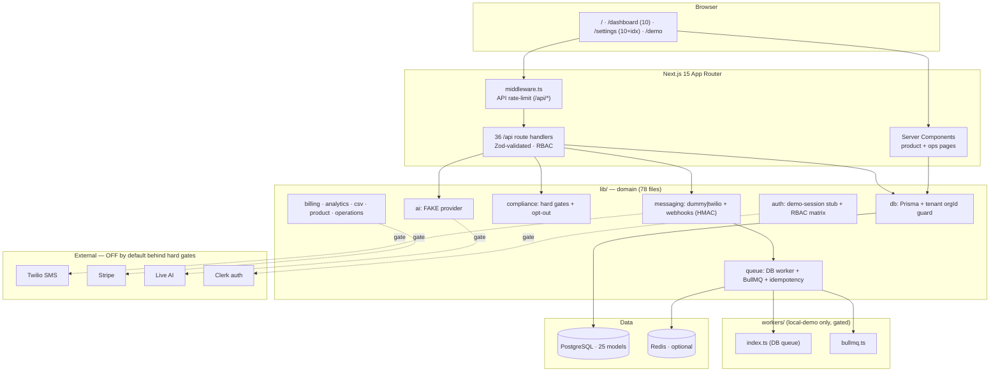

# Transformation Context — Baseline + External Research

Single source of rationale for `plan/ROADMAP.md` and `plan/specs/*`. Generated 2026-05-28 from
ground-truth commands + three parallel research streams. Verified claims are marked; assumptions are
flagged UNCERTAIN. Canonical product docs remain authoritative: `GOAL.md`, `ROADMAP.md`,
`docs/ai/ULTRAPLAN.md`, `docs/CANONICAL_IMPLEMENTATION_PLAN.md`, `tickets/`.

---

## PART A — REPO BASELINE REPORT (ground truth)

### Purpose & value prop
Demo-safe, multi-tenant SMB SMS/MMS marketing + shared inbox + lead-qualification SaaS. Every real-world
side effect (live SMS, billing, AI, prod auth/workers, prod deploy) is off by default behind executable
hard gates; the only live path is the multi-gated `/demo` live-test SMS form. Built to be driven by
autonomous agents.

### Tech stack & versions (installed lockfile, `npm ls`/`npm outdated` — verified)
- Next.js **15.5.18** (latest 16.2.6), React/React-DOM **19.2.6** (latest 19.2.x), TypeScript **5.9.3**
  (latest 6.0.3), Prisma + @prisma/client **6.19.3** (latest 7.8.0), BullMQ **5.76.10** (5.77.6),
  Zod **3.25.76** (4.4.3), Tailwind **3.4.19** (4.3.0), Vitest **3.2.4** (4.1.7), ESLint **9.39.4** (10.4.0).
- **Note:** `package.json` carets (`next ^15.3.2`, `react ^19.0.0`, …) are far below installed — see
  ground-truth correction below.

### Architecture (Mermaid)

All responses carry a security-header baseline + CSP (`next.config.mjs`, SPEC-003). Gate =
`scripts/validate.ts` (18 steps incl. `security:check`) + integrity-pinned `scripts/local-gate.ps1`.
CI = `.github/workflows/ci.yml` (PR + push main; now provisions Postgres+Redis + migrate/seed),
`premerge.yml` (manual), `automerge.yml` (placeholder).

### Current state — verified (2026-05-29, this machine; supersedes the 2026-05-28 run)
- Components verified individually with real commands: **`npm test` → 417 unit tests / 69 files PASS**,
  **`npm run build` → PASS**, `typecheck` / `lint` / `db:validate` PASS, **12/12 domain gates** PASS
  (the 10 above + `security:check` from SPEC-003 + `ai:check` from SPEC-007).
- **`npm run validate` exits 1 on Windows** — it aborts at the `db:generate` step (EPERM renaming
  `query_engine-windows.dll.node`; Defender/AV holds the DLL — client is already generated & valid),
  *before* the later `test`, `test:e2e:smoke`, and `build` steps. Not a code defect; Linux/CI is unaffected.
  On Windows, run `npm test` / `npm run build` directly (done here), or rely on CI for a clean full gate.
- **`test:e2e:smoke` NOT RUN** here (needs Postgres + Chromium).
- `npm audit`: **2 moderate** transitive only (postcss `<8.5.10` XSS, pulled via next) — low real risk;
  resolved only by a future next major upgrade (BACKLOG). [GHSA-qx2v-qp2m-jg93]
- **AI provider seam shipped (SPEC-007):** `lib/ai/provider.ts` (`resolveAiProvider` → fake default, gated
  live), `lib/ai/ai-gate.ts` (4-condition hard gate), per-tenant cap + PII-redacted prompts; the reply route
  is draft-only and `ai:check` enforces it. Live key/cost enablement remains human-gated. (The other 3
  `app/api/ai/*` routes still call `assertFakeAiProvider()` — extending the seam to them is SPEC-008.)

### Strengths
- One green aggregated gate; executable policy gates; integrity-pinned gate scripts + AXIOMS.
- Strong tenant isolation discipline (orgId), Zod-at-boundaries, contracts-first.
- **Twilio webhook signature IS verified** — `lib/messaging/twilio-webhooks.ts` uses
  `createHmac("sha1", authToken)` + `timingSafeEqual` (constant-time). (Corrects a research assumption.)
- Demo-safe defaults + hard gates protect all external impact; secrets gitignored, `secrets:scan` gate.

### Weaknesses / debt (verified) → mapped to specs
1. **Dockerfile runtime bug:** `CMD ["npm","start"]` but **no `start` script** in package.json →
   image fails to serve. → SPEC-001.
2. **CI has no Postgres/Redis service** yet `local-gate.ps1`→`validate` includes `test:e2e:smoke` needing
   Postgres → CI cannot actually pass e2e (the "verified by CI" claim is UNCERTAIN/likely false). → SPEC-002.
3. **No security headers / CSP** — `next.config.mjs` is `{}`; middleware matcher is `/api/*` only, so pages
   get none; `x-powered-by` not disabled. → SPEC-003.
4. **README.md is stale + bloated** — describes ~23 `/settings` pages **deleted in Phase A**
   (reports, workflows, releases, integrations, team, billing, ai, numbers, system, usage, data, audience,
   templates, inbox, webhooks, campaigns, contacts, notifications, demo, contracts, environment, api) and
   is stuffed with agent/operations minutiae. → SPEC-004.
5. **package.json carets stale** vs installed; whole stack 1–2 majors behind latest. → SPEC-005 / BACKLOG.
6. **Auth is a demo stub** (`lib/auth/demo-session.ts` → single hardcoded OWNER). → existing **TICKET009**.
7. **No outbound inbox reply** path. → existing **TICKET003**.
8. **AI is fake** (4 AI routes backed by deterministic fake provider). → SPEC-007/008 (gated).
9. **No app observability** (no OTel/instrumentation, no structured PII-safe logging). → SPEC-006.

### Open questions (UNCERTAIN — need a human or CI run)
- Does CI actually pass today, or is e2e silently failing/red? (No Postgres service in `ci.yml`.)
- Is there branch protection / who merges PRs? (`automerge.yml` is a placeholder.)
- Target production host (Vercel vs container)? Affects SPEC-003 (headers), SPEC-006 (OTel), pooling.

---

## PART B — EXTERNAL CONTEXT & OPPORTUNITIES (cited; 2026)

### Stack best-practices
- Next 15 made GET route handlers + client router cache **uncached by default**; Next 16 introduces
  `use cache`/Cache Components, PPR default, and renames `middleware.ts`→`proxy.ts` — a major upgrade
  needing a caching/auth audit. [nextjs.org/blog/next-15, /blog/next-16]
- Re-check authZ **inside every server action/route handler**; middleware is routing, not a security
  boundary (cf. CVE-2025-29927). Route via a server-only Data Access Layer; never capture secrets in
  Server Action closures. [nextjs.org/blog/security-nextjs-server-components-actions, authgear.com]
- **Prisma multi-tenancy:** app-level `orgId` (current approach) relies on developer discipline; Postgres
  **RLS** gives DB-enforced isolation that survives app bugs — worth it for sensitive SaaS. Prisma ships an
  RLS client extension (`SET LOCAL app.current_org_id`); caveat: interacts with `$transaction` batching.
  Pooling: PgBouncer transaction-mode + separate direct URL for migrate. [prisma docs; AWS RLS blog]
- **BullMQ:** deterministic `jobId` for idempotency, `limiter` for downstream rate caps, `worker.close()`
  on SIGTERM, `removeOnComplete/Fail` TTLs, `exportPrometheusMetrics()` + watch `stalled`. [docs.bullmq.io]

### Domain + compliance (US, 2026)
- **2026 table-stakes:** two-way shared inbox, STOP/HELP auto-handling, keyword + custom-field
  segmentation, drip/scheduled campaigns, MMS, CRM sync, A2P 10DLC onboarding, analytics, **AI message
  drafting** (now baseline even at SMB tier). **Differentiators:** AI lead qualification/routing, AI
  Concierge two-way automation, predictive/behavioral segmentation + revenue attribution, RCS, voice.
  [Salesmsg, Textline, EZ Texting, Attentive, Klaviyo SMS — see PART C sources]
- **LEGALLY/CARRIER-REQUIRED to send:** A2P 10DLC brand+campaign registration (Trust Score sets
  throughput); **from 2026-06-30 campaign registration requires public PrivacyPolicyUrl + Terms URL**
  [twilio.com/en-us/changelog]; TCPA prior express written consent for marketing; mandatory
  STOP/HELP/UNSTOP; **quiet hours 8am–9pm recipient local time**; consent-evidence storage (number, exact
  timestamp, capture method, verbatim disclosure) retained **≥4 yrs**; penalties $500–$1,500/violation.
  [twilio.com/docs/messaging/compliance/a2p-10dlc; ctia.org; activeprospect.com; tatango.com]
- **Opportunity:** the repo's hard compliance gates already align with these; the highest-leverage product
  bets are **AI reply drafting (review-before-send)** and **AI lead qualification/scoring** (only ~28% of
  businesses use AI in SMS today). [relevanceai; sakari.io; attentioninsight.com]

### Security / observability / deps (cited)
- **OWASP Top 10:2025** folded SSRF into Broken Access Control — relevant to webhook handlers.
  Next 15 hardening: CSP+nonce (avoid `unsafe-inline`), HSTS, X-Frame-Options/`frame-ancestors`,
  X-Content-Type-Options, secure cookies, Zod on every boundary. [owasp.org/Top10/2025; nextjs.org CSP]
- **CVEs vs the installed tree (ground-truth correction):** the critical RCEs — next
  **CVE-2025-66478** (fixed 15.3.6) and react **CVE-2025-55182** (fixed 19.2.1) — are **already mitigated**
  by installed **next 15.5.18 / react 19.2.6**. Remaining: 2 moderate transitive postcss (audit); and a
  **deployment-time** concern: Redis **CVE-2025-49844** (patch Redis ≥7.4.x/8.2.2 — docker-compose pins
  `redis:7-alpine`, should pin a patched tag). [nextjs.org/blog/CVE-2025-66478; react.dev 2025-12-03; redis.io]
- **NEW (refreshed 2026-05-29):** Next.js shipped a **coordinated security release in May 2026** — 13
  advisories: DoS (**CVE-2026-23864**, **CVE-2026-23870**), `.rsc`/segment-prefetch **middleware-bypass**,
  SSRF via WebSocket upgrade (self-hosted Node), cache-poisoning, XSS. Patched floor = **next 15.5.18 /
  16.2.6** → installed **15.5.18 is already on the patched floor** (no action). The middleware-bypass class
  reinforces existing doctrine: **middleware is routing, not a security boundary** — re-check authZ in every
  route handler/DAL (the repo already does; keeps SPEC-003 headers + TICKET009 auth in the handler).
  [vercel.com/changelog/next-js-may-2026-security-release; akamai.com CVE-2026-23864]
- **A2P privacy/terms (confirmed, date-sensitive):** from **2026-06-30** Twilio A2P 10DLC campaign
  registration returns a hard **400** without public HTTPS `PrivacyPolicyUrl` + `TermsAndConditionsUrl`
  (Twilio fetches them). ~1 month out — SPEC-009 already covers it; `complianceProfileIsComplete` enforces
  URL completeness today. [twilio.com/en-us/changelog a2p privacy-policy/terms]
- **Clerk multi-tenant:** `clerkMiddleware()` + `createRouteMatcher`/`auth.protect()`,
  `organizationSyncOptions` to bind tenant from URL, server-side `auth()` returns `{userId,orgId,orgRole}`;
  keep a provider-agnostic `getAuthContext()` for the demo fallback. [clerk.com docs] → TICKET009.
- **Observability:** Next 15 native OTel via `instrumentation.ts` + `@vercel/otel`; init OTel in the worker
  process too; structured JSON logs with an allowlist redactor (never log phone numbers/SMS bodies);
  Sentry `sendDefaultPii:false` + `beforeSend` scrub. SMS metrics: delivery rate, send→delivered latency,
  queue depth, failure-by-error-code, webhook-verify-failure rate. [nextjs.org OTel; docs.sentry.io] → SPEC-006.

### MAJOR MIGRATION RISKS (flagged)
- **Next 15→16** caching/`proxy.ts` overhaul; **Prisma 6→7** new TS query engine; **Zod 3→4** breaking
  (touches every boundary); **TS 5→6**; **Tailwind 3→4**. All are multi-file, gated efforts → BACKLOG,
  one major per isolated branch with full gate + visual check. Do **not** bundle with feature work.

## PART C — key sources
Next.js: nextjs.org/blog/next-15, /next-16, /security-nextjs-server-components-actions, /CVE-2025-66478,
/docs/app/guides/open-telemetry, /docs CSP. React: react.dev/blog/2025/12/03. Prisma: prisma.io/docs
(pgbouncer, connection-pool), github.com/prisma/prisma-client-extensions/row-level-security; AWS RLS blog.
BullMQ: docs.bullmq.io (concurrency, graceful-shutdown, going-to-production, prometheus). Redis:
redis.io/blog/security-advisory-cve-2025-49844. OWASP: owasp.org/Top10/2025. Clerk: clerk.com/docs.
Compliance: twilio.com/docs/messaging/compliance/a2p-10dlc, twilio.com/en-us/changelog (privacy-policy
req), ctia.org messaging principles, activeprospect.com (TCPA), tatango.com (retention). Competitors:
salesmessage.com, getapp.com (Textline), business.com/textbolt (EZ Texting), capterra/community.com,
sequenzy.com (Attentive), subjectlime.com (Klaviyo). AI: relevanceai, sakari.io, attentioninsight.com.
Refresh 2026-05-29: vercel.com/changelog/next-js-may-2026-security-release, akamai.com/blog (CVE-2026-23864),
react.dev/blog/2025/12/03, nextjs.org/blog/next-16 + /docs/app/guides/upgrading/version-16, github.com/prisma/prisma/releases (7.x — driver adapters now mandatory).
